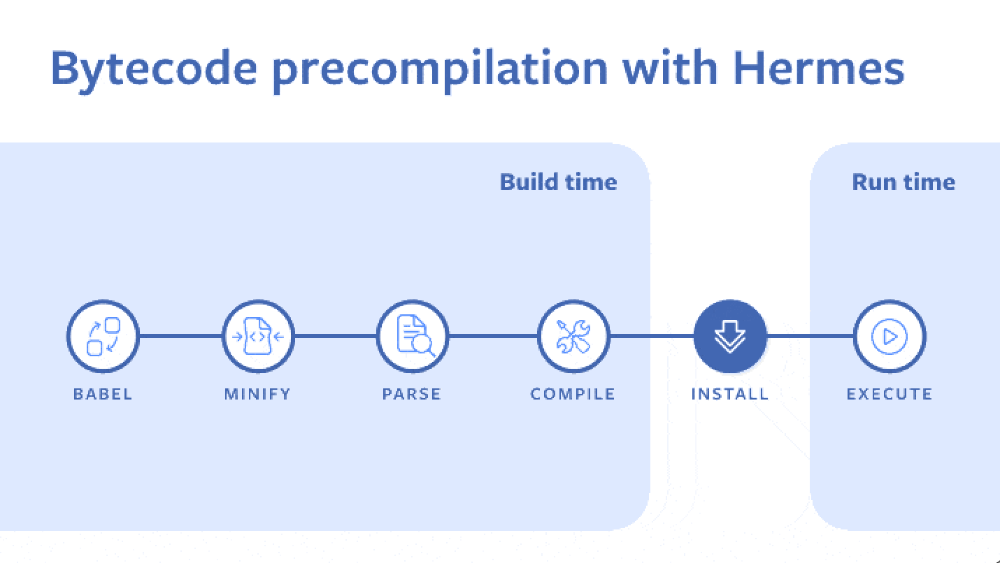

# rn-expo

리액트 네이티브가 궁금해서 만들어본 프로젝트

## Prerequired

- `node.js`: `v20.x`
- `expo go app` & `expo go account`

## Reasons for Technology Selection 기술 선정 이유

##### _왜 React Native 인가_

1. 하나의 코드베이스로 크로스 플랫폼 개발 가능하다.
2. 커뮤니티가 활성화되어있어 개발을 할 때 참고할 자료가 풍부하다.
3. Hermes 엔진으로 JavaScript를 미리 컴파일하여 초기 로딩 속도를 더 빠르게 할 수도 있다.
   
   `자바스크립트 소스를 로드한 후, 이를 파싱하여 바이트코드를 생성하는 일반적 과정`
   
   `바이트 코드 사전 컴파일하는 Hermes 엔진`
   이미지 출처 : [Hermes: An open source JavaScript engine optimized for mobile apps, starting with React Native ](https://engineering.fb.com/2019/07/12/android/hermes/)

##### _Expo_

Expo Go 앱을 사용하면 별도의 빌드 없이도 모바일 기기에서 즉시 앱을 테스트할 수 있어 빠른 프로토타입 개발에 유용한 점이 Expo 를 선택한 가장 큰 이유이다.

## Features

- 날씨 api 연동하여 날씨 정보 조회 (api.openweathermap.org)
- 한국수출입은행 OPEN API 연동하여 환율정보 조회
- expo-router: 앱 내에서 네비게이션, 스택 및 다양한 페이지를 구성
- Google Map 연동: google 맵을 페이지에 표출하고 google 맵이 없으면 기기의 기본 맵 표출
- 현 위치 지도에 노출 : expo의 geolocation api를 통해서, 현재 위치를 지도에 표시
- Push Notifications : Expo Notifications 라이브러리 이용하여 푸시 알림을 발생시키고, 푸시 알림 터치 시 설정한 앱 내 페이지로 이동

## 기능 구현

1. 네비게이션 패턴
   expo-router 의 Stack navigator 와 Tabs 레이아웃을 이용

   ```
   src
   │  ├─ app
   │  │  ├─ (tabs)
   │  │  │  ├─ _layout.tsx
   │  │  │  ├─ chat-rooms.tsx
   │  │  │  ├─ index.tsx
   │  │  │  ├─ mypage.tsx
   │  │  │  └─ settings.tsx
   │  │  ├─ _layout.tsx
   app/_layout.tsx
   ```

   ```
   import { Stack } from 'expo-router/stack';
   export default function Layout() {
   return (
      <Stack>
         <Stack.Screen name="(tabs)" options={{ headerShown: false }} />
      </Stack>
   );
   }
   ```

2. 지도에 실시간 현 위치 표시
   `react-native-maps` 를 추가하여 MapView 를 사용해 페이지에 지도를 표시.
   `MapView`의 `provider` 속성에는 os 에 따라 사용할 지도를 분기처리하였다.
   실시간 위치와는 별개로, '산책 시작하기' 버튼을 클릭하는 시점을 산책 출발 시점으로 잡아 출발 위치를 마커로 별도 표시하도록 하였다.
   이동한 거리 계산과 실시간 이동 거릴를 지도에 선으로 그리는 기능은 아직 진행 중이다. 해당 기능을 구현하기 위해 실제로 디바이스를 들고 이동을 하면서 테스트를 해야 하는 점이 꽤나 번거로운 편이다.

   ```
   <SafeAreaView style={[styles.container]}>
         <MapView
         provider={Platform.OS === 'android' ? PROVIDER_GOOGLE : PROVIDER_DEFAULT}
         style={styles.map}
         region={state}
         showsUserLocation
         followsUserLocation
         loadingEnabled
         // onRegionChange={onRegionChange}
         initialRegion={state}
         >
         {state.start && <Marker key={0} coordinate={startRegion} title={'출발한 위치'} description={''} pinColor={'orange'} />}
         <Polyline coordinates={state.routeCoordinates} strokeWidth={5} />
         </MapView>
         {!state.start && (
         <PrimaryButton
            text="산책 시작하기"
            onPress={async (e) => {
               e.preventDefault();
               setState(
               produce((draft: any) => {
                  draft.start = true;
               })
               );
               setStartRegion({ latitude: state.latitude, longitude: state.longitude });
            }}
            style={styles.startButton}
         />
         )}
         {state.start && <Text style={styles.distance}>이동한 거리 : {state.distanceTravelled} km</Text>}
      </SafeAreaView>

   ```


3. Push Notification 푸시 알림
   `expo-notifications` 라이브러리를 활용하여 구현하였다.
   먼저, 루트 페이지에서 expo-notifications 의 `requestForegroundPermissionsAsync` 함수를 이용해 알림 권한을 요청한다.
   `scheduleNotificationAsync` 를 이용해 홈 화면에 있는 '푸시 알림 전송' 을 터치하면 푸시 알림이 나타나게 하였고, 해당 푸시 알림을 터치하면 설정한 앱 내 페이지로 이동한다.
   firebase 와 연동하여 푸시 알림이 발생하게 하는 작업은 아직 테스트 진행 중이다.
   
   


5. 현 위치 날씨 정보 조회
   api.openweathermap.org 에서 제공하는 OPEN API 조회 시 expo-location 의 getCurrentPositionAsync 메소드를 이용해 받아온 현 위치의 위도/경도를 parameter 에 담아 날씨 정보를 조회한다.
   simulator 에서 실행 시 위도/경도를 잘못 잡는 경우가 있어서 우리나라의 경도값을 벗어나면 longitude 를 남산타워 위치 경도로 세팅하도록 하였다.
   날씨 아이콘은 날씨의 코드 값으로 구분하여 설정해주었다.

   


7. 환율 정보 조회
   한국수출입은행 OPEN API 를 이용해 현재 달러와 유로 정보를 표기.
   환율 정보를 호출할 때 호출한 시점이 주말이나 평일 오전 11시 이전인 경우 환율 정보를 불러올 수 없기 때문에 주말인 경우 주말 이전 금요일 기준으로 정보를 호출한다.
   평일 오전 11시 이전인 경우 전 날의 환율 정보를 가져온다.
   (월요일 오전 11시 이전이면 지난 금요일의 환율정보를 호출)


## Connect to eas build

Expo에 로그인을 하고

```bash
npm run eas login
```

아래 명령어를 실행하면 빌드 파일이 Expo에 업로드 된다.

```
eas build --profile development-simulator --platform ios
```

Build details: https://expo.dev/accounts/sujinsujin/projects/rn-expo/builds/4d166ceb-8659-4b84-820f-a8159ef7f0ae
위 링크를 들어가서 빌드 압축파일을 다운로드 받아 해제하고 시뮬레이터에 드래그하여 시뮬레이터에 개발 빌드 파일을 설치한다.
아래 명령어를 실행하면 simulator 에 설치한 빌드파일을 실행할 수 있다.

```
npx expo start -i
```
